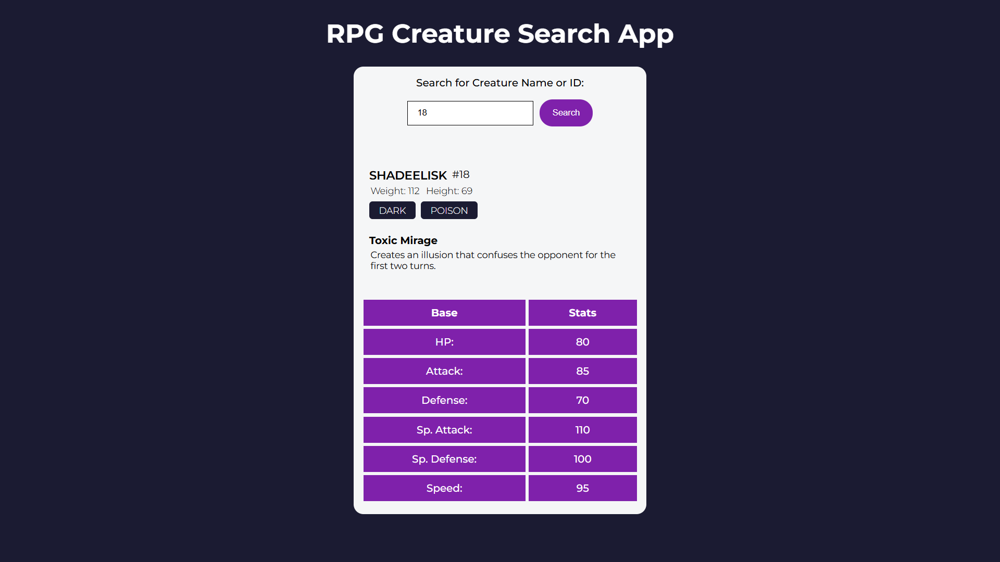

# RPG Character Search App  
A simple RPG Creature Search App that allows users to look up creatures by name or ID and view their details using the freeCodeCamp RPG Creature API.

**Link to project:** [RPG Character Search App](https://ayushsaxena0.github.io/RPG-Character-Search-App/)

---

## How It's Made:  
**Tech used:** HTML, CSS, JavaScript

I built this app using vanilla JavaScript, HTML, and CSS. The main focus was on interacting with the [freeCodeCamp RPG Creature API](https://rpg-creature-api.freecodecamp.rocks/) to fetch creature data. The user can search for a creature by either name or ID, and the app dynamically displays the creature’s image, name, and stats.

---

## Optimizations  
To improve user experience, I added input validation, better error handling for invalid IDs/names, and responsive design tweaks to make the app mobile-friendly. I also ensured minimal DOM manipulation for faster load times.

---

## Lessons Learned  
This project helped me better understand how to work with third-party APIs and handle user input cleanly. I gained more confidence in building UI-driven features using vanilla JavaScript and saw how even simple styling choices can drastically affect usability. One key takeaway was learning to structure logic efficiently while working within a constrained file setup.

